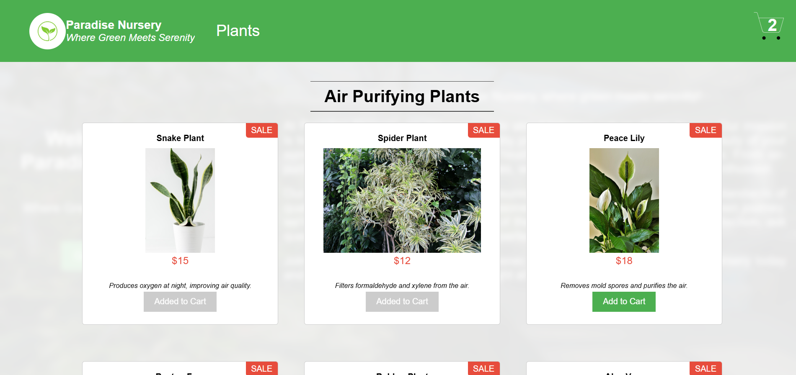
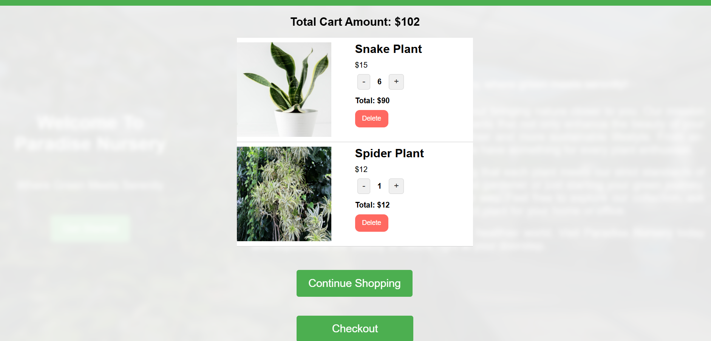

# 🌿 Paradise Nursery Shopping Application v1.0.0 - [Live Deployment](https://alan6282.github.io/e-plantShopping/)

## 🛠 Tech Stack

<p align="left">
  
  
  
  
  
  
</p>

A fully responsive **React + Redux Toolkit** front-end shopping UI for houseplants.  
This project was created as part of the **IBM – Developing Front-End Apps with React** final project and deployed via **gh-pages** (Vite).


---

## 🔎 Quick Demo (one-click)
- **Live Deployment:** https://alan6282.github.io/e-plantShopping/  
  Click the link above or use the **Get Started** button on the landing page to jump to the product listing.

---

## 📌 Project Summary (single-file overview)
Paradise Nursery is a frontend-only React application that demonstrates:
- Product listing with cards (image, name, price, description)
- Add-to-cart flow with disabled "Added to Cart" state
- Global state management via **Redux Toolkit** (add/remove/quantity)
- Shopping cart page showing totals, per-item totals, and quantity controls
- Vite build + gh-pages deployment for a project GitHub Pages site

> This repository contains only the front-end (no server/backend). Data is stored locally in the app.

---

## 📁 Folder structure


```
e-plantShopping/
├── README.md
├── package.json
├── vite.config.js
├── index.html
├── .gitignore
├── public/
│ ├── favicon.ico
│ └── robots.txt
├── src/
│ ├── main.jsx
│ ├── App.jsx
│ ├── index.css
│ ├── assets/
│ │ └── images/
│ │ ├── landing.jpg
│ │ ├── snake-plant.jpg
│ │ ├── spider-plant.jpg
│ │ ├── peace-lily.jpg
│ │ └── ...
│ ├── components/
│ │ ├── Header.jsx
│ │ ├── Landing.jsx
│ │ ├── ProductList.jsx
│ │ ├── ProductCard.jsx
│ │ ├── CartPage.jsx
│ │ └── AboutUs.jsx
│ ├── store/
│ │ ├── store.js
│ │ └── cartSlice.js
│ └── data/
│ └── products.js
├── dist/ # generated by npm run build (do not commit)
└── screenshots/ # optional (landing.png, products.png, cart.png)
```

---

## 🎯 Features
- **Landing page**: background image, intro paragraph, Get Started button
- **Product listing**: category headings, product cards, sale badge
- **Add to cart**: button toggles to "Added to Cart" and becomes disabled
- **Cart page**: shows each item, per-item total, quantity +/- controls, delete
- **Header**: cart icon with live item count badge
- **Responsive**: works on desktop and mobile
- **State**: Redux Toolkit (slices, store, selectors)
- **Deployment**: Vite + gh-pages (project page)

---

## ⚙️ Install (in one place)
Run these commands in project root:

```bash
npm install
npm install gh-pages --save-dev
```

----
## 🧪 Run locally
Start dev server:

```bash
npm run dev
# open http://localhost:5173
```
----

## 📦 Build for production

```bash
npm run build
# output placed into dist/
```

## 🚀 Deploy to GitHub Pages

Ensure these scripts exist in package.json:

```bash
"scripts": {
  "dev": "vite",
  "build": "vite build",
  "predeploy": "npm run build",
  "deploy": "gh-pages -d dist"
}
```

Make sure vite.config.js has base set to your repository name:
```bash
import { defineConfig } from 'vite'
import react from '@vitejs/plugin-react'

export default defineConfig({
  base: "/e-plantShopping/",   // <-- set this to "/<repo-name>/"
  plugins: [react()]
})
```

Then deploy:

```bash 

npm run deploy

```

## 📸 Screenshots 






